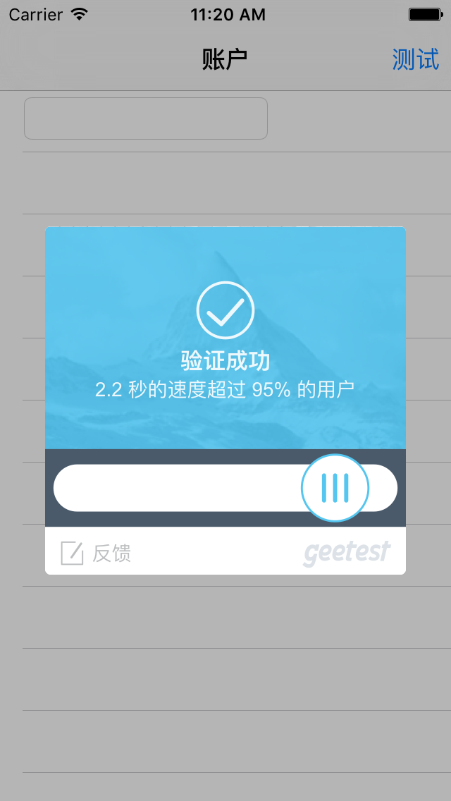
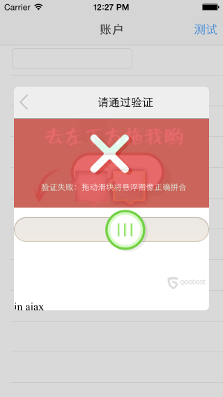

================================================
gtapp-ios-oc
================================================

为了方便第三方开发者快速集成 极验验证 SDK，我们提供了以下联系方式，协助开发者进行集成。

QQ群: 487868018 (iOS) 请注明验证信息

关于SDK的Bug反馈、用户体验、以及好的建议可以在Github或QQ群提交给我们，我们会讨论合理性后会尽快跟进。

.. contents:: 目录
.. sectnum::

Screenshot
================================================

Outline
================================================

主要层次:
---------------------------------------------------------------------

验证主要分为三个部分：
    1.  从网站主服务器 获取所需的验证数据 (id,challenge,success)
    2.  核心验证过程
    3.  根据验证回调数据进行二次验证

其中:
---------------------------------------------------------------------

iOS SDK 主要完成过程:
    1.  给出默认的failback机制 获取所需的验证数据 (网站主也可以根据自己的服务器配置以及需求完成此过程,但必须保持通讯流程完整)
    2.  完成核心验证过程

demo 演示完成的部分
    1.  二次验证不是由sdk完成，而是网站主自己根据demo的逻辑以及网站主的服务器配置来完成这一块的部署

Version
================================================

Description
---------------------------------------------------------------------

1.  请认真查阅开发者文档,支持iOS7以上.[*please read developer doc, and support iOS7+*]
#.  在gtapp-ios-oc项目下已经有两个版本，一个是早期版本，framework版本号为2.15.5.＊之前,已经停止开发,另一个是有failback版本的,版本号为2.15.8.＊之后的版本,现在持续更新和维护中。[*There are two versions of GTFramework. The latest one has the failback feature (version 2.15.8.＊ +). We had stopped to develop the old version. So we recommend you to use the failback version.*]
#.  failback版本在项目路径的‘gt-iOS-sdk-failback -demo’下。[*the failback version in the file 'gt-iOS-sdk-failback -demo'*]
#.  推荐failback版本！！！该版本更为安全，即使极验服务暂时不可用，网站主在相应逻辑位置写入备用验证或处理方法，即可轻松切换。[*The faiback version more safe than the old one. If gt-server is not available, you can set some handle methods*]
#.  详细内容查看目录下的开发者文档。[*get more information in demo files*]

Failback
---------------------------------------------------------------------

1.  2.15. 5.x            : no failback version
#.  2.15. 8.x - current  : failback version

About gtapp-ios-oc
================================================

1.	GTFramework 极验验证iOS版本的SDK，生成一个基于i386、x86_64、armv7、 armv7s、arm64的framework，支持iOS7.0＋。开发使用的Xcode版本为Xcode 7.0。[*build on i386、x86_64、armv7、 armv7s、arm64, and support iOS7+*]
#.	gt-iOS-sdk-demo 调用sdk的演示app程序。 [*use demo to know more about GTFramework*]
#.	演示项目提供了完整的一次验证，并将客户端验证结果向示例的客户服务器上发起二次验证的完整通讯过程。[*in the demo, we provide a networking flow completely*]
#.	不依赖任何第三方库，demo里的代码可根据网站主项目需要自行修改。[*you can change what you want in the demo*]
#.  如果使用failback版本的请下看项目路径下‘gt-iOS-sdk-failback -demo’ [*the failback version in the file 'gt-iOS-sdk-failback -demo'*]

How to use GTFramework, run the demo first
================================================

自建项目引用
假设用户自建项目名称为：TestGT

1.	在极验官方主页www.geetest.com注册账号并申请相应的应用公钥，id:{{id}}。[*get geetest id/key from*  `geetest.com <http://www.geetest.com>`_ ]
#.	将gt-iOS-sdk下的GTFramework项目生成的静态库GTFramework.framework引入到项目中 [*import GTFramework to your preject*]
#.	将GTFramework.framework项目以Static Library的方式进行引用。将所需的GTFramework.framework拷贝到工程所在文件夹下。在 TARGETS->Build Phases-> Link Binary With Libaries中点击“+”按钮，在弹出的窗口中点击“Add Other”按钮，选择GTFramework.framework文件添加到工程中。[*add GTframework to 'Link Binary With Libaries'*]
     
#.	在项目标有TODO注释的地方写入网站主自已的处理代码。[*add you handle method where signed 'TODO'*]
   
集成GTFramework到swift项目
================================================

暂时只提供纯Objective-C的Framework

导入外部框架,无论框架是纯Objective-C,纯Swift还是混合语言,import外部框架的流程是一样的。当你要导入外部框架的时,确保Build >Packaging >Defines Modele 设置为Yes.

用下面的语法将框架导入到相应的target的Swift文件中:

.. code ::

    import FrameworkName

用下面的语法将框架导入到相应target的 Objective-C .m 文件中:

.. code ::
    
    @import FrameworkName;

更多请查阅官方文档 `Using Swift with Cocoa and Objective-C (Swift 2) <https://developer.apple.com/library/ios/documentation/Swift/Conceptual/BuildingCocoaApps/MixandMatch.html#//apple_ref/doc/uid/TP40014216-CH10-ID122>`_

iOS9的适配问题<tips>
================================================

iOS9适配详细可跳转至  `iOS9适配tips <https://github.com/ChenYilong/iOS9AdaptationTips>`_

对网络传输安全协议https的支持
---------------------------------------------------------------------

    由于 iOS 9 改用更安全的https，为了能够在iOS9中正常使用http，请在"Info.plist"中进行如下配置，否则影响网络的使用。

暂时的解决方案:

方案A:
    强制将NSAllowsArbitraryLoads属性设置为YES，并添加到你应用的plist中

.. code ::

    <key>NSAppTransportSecurity</key>
    <dict>
    <key>NSAllowsArbitraryLoads</key>
    <true/>
    </dict>

方案B:
    建立白名单并添加到你的app的plsit中

.. code ::

    <key>NSAppTransportSecurity</key>
    <dict>
        <key>NSExceptionDomains</key>
        <dict>
            <key>geetest.com</key>
            <dict>
                <key>NSIncludesSubdomains</key>
                <true/>
                <key>NSThirdPartyExceptionAllowsInsecureHTTPLoads</key>
                <true/>
                <key>NSThirdPartyExceptionRequiresForwardSecrecy</key>
                <false/>
            </dict>
        </dict>
    </dict>

方案C:
	依赖TLS建立白名单的另一种配置方法

.. code ::

    <key>NSAppTransportSecurity</key>
    <dict>
    	<dict>
    	<key>NSAllowsArbitraryLoads</key>
    	<true/>
    	</dict>
        <key>NSExceptionDomains</key>
        <dict>
            <key>geetest.com</key>
            <dict>
                <key>NSIncludesSubdomains</key>
                <true/>
                <key>NSTemporaryExceptionAllowsInsecureHTTPLoads</key>
                <true/>
                <key>NSTemporaryExceptionMinimumTLSVersion</key>
                <string>TLSv1.1</string>
            </dict>
        </dict>
    </dict>

bitcode
---------------------------------------------------------------------

苹果在iOS9的SDK中添加了对应用的瘦身的支持，其中就包括bitcode。你可以以如下方法解决bitcode适配问题
    
    我们目前也在编译生成了支持bitcode版本的sdk。该版本的sdk请见failback demo目录，将文件"GTFramework_bitcode"去掉后缀后的替换原GTFramework文件。

或者:

    通过设置编译标志ENABLE_BITCODE = NO，亦或者修改工程的构建设置(build settings)可关闭bitcode功能

Xcode7适配问题
================================================

使用第三方库导致的问题
---------------------------------------------------------------------

`Lots of warnings when building with Xcode 7 with 3rd party libraries <https://forums.developer.apple.com/thread/17921>`_

在Build Settings 作如下配置

.. code ::

	Precompile Prefix (GCC_PRECOMPILE_PREFIX_HEADER) = NO
	Debug Information Format (DEBUG_INFORMATION_FORMAT) = DWARF with dSYM
	Enabled Modules (C and Objective-C) (CLANG_ENABLE_MODULES) = NO

如果不可行尝试

.. code ::

	Enabled Clang Module Debugging = NO

回调Block及返回值
================================================

.. code ::
	
    Block：
	   ^(NSString *code, NSDictionary *result, NSString *message) {} 
	
返回值：

1.code
    成功或者失败的值（1：成功/其他：失败）
    status code, (1: success/2: fail)
2.message
    成功或者失败的信息（success/fail）
    description about your result
3.result
    详细的返回信息，用于向客户服务器提交之后的SDK二次验证信息
    if you want to finish Secondery-Validate ,you should send those result information to your server.
	
.. code ::

    {
     "geetest_challenge": "5a8c21e206f5f7ba4fa630acf269d0ec4z",
     "geetest_validate": "f0f541006215ac784859e29ec23d5b97",
     "geetest_seccode": "f0f541006215ac784859e29ec23d5b97|jordan"
     }
