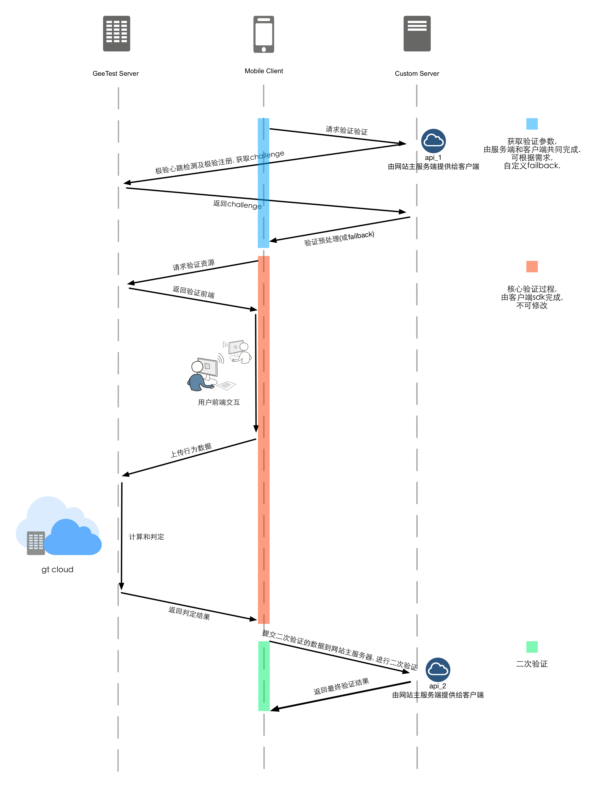
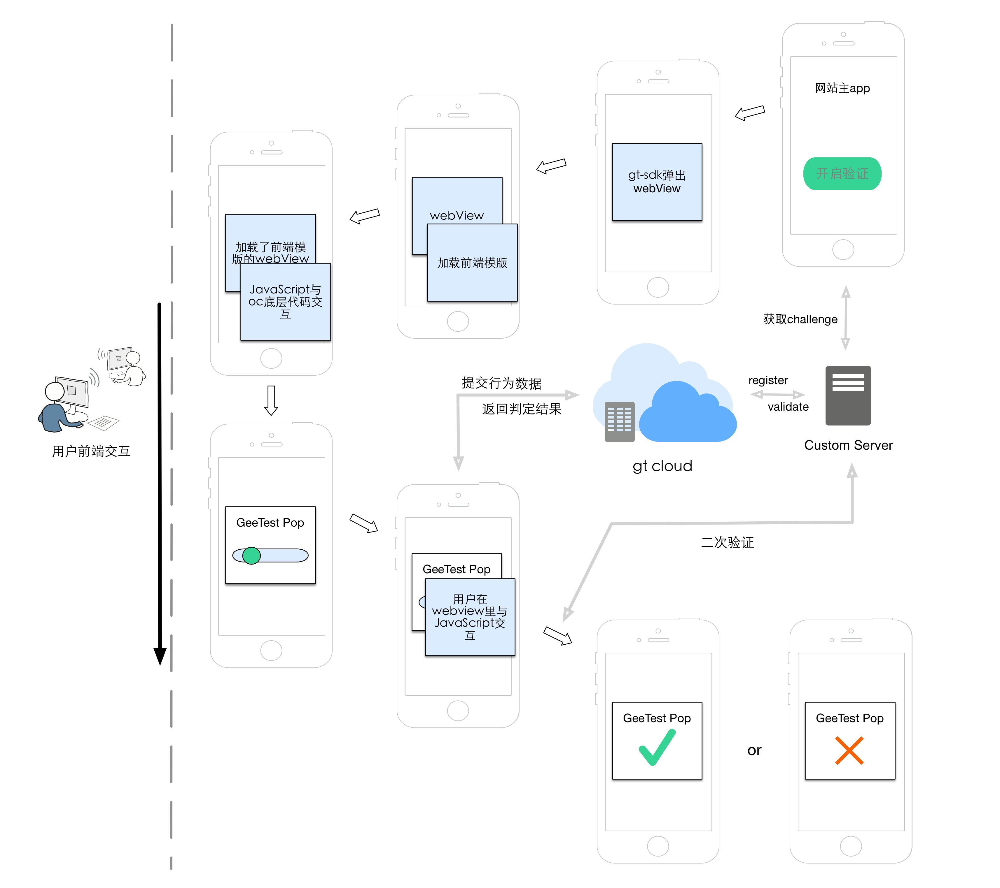
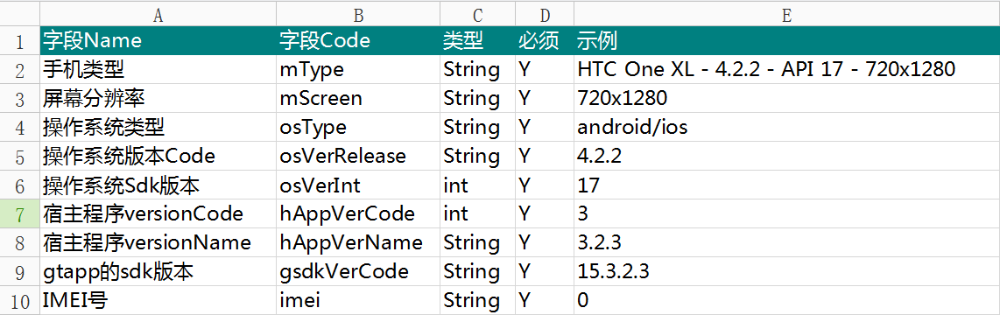
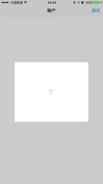
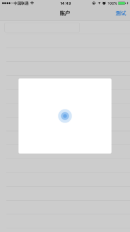

====================================
iOS-Dev
====================================

.. contents:: 目录

概述
================================================

1.	 gt-iOS-sdk 极验验证iOS版本的SDK，生成一个基于i386、x86_64、armv7、 armv7s、arm64的Static Library，支持iOS7.0＋。开发使用的Xcode版本位Xcode 7.2。
#.	 gt-iOS-sdk－failback-demo 调用sdk的演示app程序。
#.	在gt-iOS-sdk-failback-demo下TestGT项目倒入生成的GTFramework.framework静态库，即可运行TestGT项目。
#.	演示项目提供了用户服务器的预处理以及完整的一次验证，并将客户端验证结果向示例的客户服务器上发起二次验证的完整通讯过程。
#.	不依赖任何第三方库, 需要导入webkit.framework, demo可根据项目需要自行修改。
#.  iOS端sdk必须与服务器部署代码配套使用，否者无法完成二次验证。`服务器部署代码请移步官网安装文档   <http://www.geetest.com>`__

验证主要分为三个部分：
	1.	从网站主服务器获取所需的验证数据(id,challenge,success)
	2.	核心验证过程
	3.	根据验证回调数据进行二次验证

iOS SDK 主要完成过程:
	1.	给出默认的failback机制获取所需的验证数据(网站主可以根据自己的需求自己完成此过程)
	2.	完成核心验证过程
	3.	二次验证不是由sdk完成，而是网站主自己根据demo的逻辑来完成这一块的部署

需求
================================================

1. ios 7.0 +
2. xcode 6.0 +
3. arc
4. webkit.framework

搭建Demo
=================================================

自建项目引用
假设用户自建项目名称为: TestGT

1.  在极验官方主页www.geetest.com注册账号并申请相应的应用公钥，id:{{id}} 
#.  将gt-iOS-sdk-failback文件夹下的GTFramework.framework引入到项目中
#.  将GTFramework.framework项目以Static Library的方式进行引用。
        将所需的GTFramework.framework拷贝到工程所在文件夹下。在 TARGETS->Build Phases-> Link Binary With Libaries中点击“+”按钮，在弹出的窗口中点击“Add Other”按钮，选择GTFramework.framework文件添加到工程中。
#.  在项目中有4处标注'TODO'的位置，请网站主根据提示写入用户自已的处理代码。

通讯流程图
=======================================

实现流程图
=======================================

采集设备静态信息
=======================================

mobileInfo里面的具体字段描述表
-------------------------------------------------------------------

_mobileInfo   手机静态信息举例 Code Sample
-------------------------------------------------------------------

.. code::

    _mobileInfo = [@{@"mType" : [GTData osType],
                         @"mScreen" : [GTData screen],
                         @"osType" : @"ios",
                         @"osVerRelease" : [GTData systemVersion],
                         @"osVerInt" : [GTData systemVersion],
                         @"hAppVerCode" : [GTData buildVersion],
                         @"hAppVerName" : [GTData buildVersionRelease],
                         @"gsdkVerCode" : @"2.15.8.7.1",
                         @"imei" : @"000000000000000" } mutableCopy];

	
回调Block及返回值
========================================
验证结果返回后的操作,非主线程操作

.. code::
	
    typedef void(^GTCallFinishBlock)(NSString *code, NSDictionary *result, NSString *message); 
	
返回值：

1.code
    成功或者失败的值（1：成功/其他：失败）（success/fail）
2.message
    成功或者失败的信息（some description）
3.result
    详细的返回信息，用于向客户服务器提交之后的SDK二次验证信息
	
.. code::

    {
     "geetest_challenge": "5a8c21e206f5f7ba4fa630acf269d0ec4z",
     "geetest_validate": "f0f541006215ac784859e29ec23d5b97",
     "geetest_seccode": "f0f541006215ac784859e29ec23d5b97|jordan"
     }

验证关闭block
========================================
验证关闭的操作,非主线程操作

.. code::

    typedef void(^GTCallCloseBlock)(void);

gt验证SDK Header暴露的方法
========================================
客户端向网站主服务器发起验证请求,并配置验证
---------------------------------------------------------------

获取并且解析用于验证的必要数据,并且自动配置验证

向CustomServer发送geetest验证请求，如果网站主服务器判断geetest服务可用，返回验证必要的数据

@param requestCustomServerForGTestURL   客户端向网站主服务端发起验证请求的链接(api_1)

@param timeoutInterval                  超时间隔

@param name                             网站主http cookie name的键名

@param RequestType                      请求的类型

@param handler                          请求完成后的处理

@return 只有当网站主服务器可用时，以block的形式返回以下数据

.. code::
	{
     "challenge": "12ae1159ffdfcbbc306897e8d9bf6d06" ,
     "gt"       : "ad872a4e1a51888967bdb7cb45589605" ,
     "success"  : 1 
    }

.. code::
    
    - (void)configureGTest:(NSURL *)requestCustomServerForGTestURL 
    	   timeoutInterval:(NSTimeInterval)timeoutInterval 
    	withHTTPCookieName:(NSString *)name
    			   options:(DefaultRequestTypeOptions)RequestType 
    	 completionHandler:(GTDefaultCaptchaHandlerBlock)handler;

options: 请求选项

.. code::
    
    typedef NS_ENUM(NSInteger, DefaultRequestTypeOptions){
        //发送同步请求, 基于 [NSURLConnection sendSynchronousRequest: returningResponse: error:&error]
        GTDefaultSynchronousRequest,
        //发送异步请求, 基于 NSURLConnectionDataDelegate
        GTDefaultAsynchronousRequest
    };

使用id,challenge和success配置验证
-------------------------------------------------------------------

此方法提供给不使用或不便于使用默认failback功能而自己搭建failback机制的用户

@param captcha_id   在官网申请的captcha_id

@param gt_challenge 从geetest服务器获取的challenge

@param success      网站主服务器监测geetest服务的可用状态

@return YES可开启验证，NO则客户端与geetest服务端之间连接不通畅

.. code::

	- (BOOL)configureGTest:(NSString *)captcha_id 
			     challenge:(NSString *)gt_challenge
			       success:(NSNumber *)successCode;

错误处理的代理方法
-------------------------------------------------------------------

GTManageDelegate, 处理错误的代理方法

.. code::

    @required
    - (void)GTNetworkErrorHandler:(NSError *)error;

可能出现的error:

1.  NSURLErrorTimedOut 超时
    
        与开发人员配置的超时时间和用户的网络情况的有关, 在低速网络可以对这块做测试
#.  NSURLErrorCancelled 取消了网络请求

        一般不出现, 可能出现的情况是异步网络加载的时候, 用户关闭了验证

#.  NSURLErrorCannotFindHost 无法找到主机
    
        网络异常, 检查网络
#.  NSURLErrorCannotConnectToHost 无法连接到极验服务器
        
        网络异常, 无法连接到极验服务器
#.  NSURLErrorNotConnectedToInternet 没有连接到互联网

        没有网络时提示
#.  json解析出错(error code = 3840等)

        在使用默认的failback里使用了json转字典, 检查网站主服务器返回的验证数据格式是否正确(也可能在failback接口下, 增加了额外的键值导致)

        解析使用JSONObjectWithData: options: error:方法

<!>展示验证<!>
-------------------------------------------------------------------

验证最核心的方法，在此之前必须先配置好验证

实现方式 直接在 keyWindow 上添加遮罩视图、极验验证的UIWebView视图
极速验证UIWebView通过JS与SDK通信

@param finish   验证返回结果

@param close    关闭验证

@param animated 开启动画 

.. code::
    
    - (void)openGTViewAddFinishHandler:(GTCallFinishBlock)finish 
    					  closeHandler:(GTCallCloseBlock)close
    					  	  animated:(BOOL)animated;

提前关闭gt验证
-------------------------------------------------------------------

关闭正在显示的验证界面

.. code::
    
    - (void)closeGTViewIfIsOpen;

配置状态指示器
-------------------------------------------------------------------

配置加载验证时的状态指示器

@param animationBlock 自定义时需要实现的动画block,仅在type配置为GTIndicatorCustomType时才执行

@param type           状态指示器的类型

.. code::

    - (void)configureAnimatedAcitvityIndicator:(GTIndicatorAnimationViewBlock)animationBlock
             withActivityIndicatorViewType:(ActivityIndicatorViewType)type;

ActivityIndicatorViewType:

.. code::

    typedef NS_ENUM(NSInteger, ActivityIndicatorViewType) {
    /** System Indicator Type 系统样式*/
    GTIndicatorSystemType = 0,
    /** Geetest Defualt Indicator Type 极验验证默认样式*/
    GTIndicatorDefaultType,
    /** Custom Indicator Type 自定义样式*/
    GTIndicatorCustomType,
    };

GTIndicatorSystemType

GTIndicatorDefaultType

.. image:: img/indicator_default.png

GTIndicatorCustomType(sample), 可根据需要修改

HTTPS支持(非必要方法,默认不使用https)
-------------------------------------------------------------------

使用https协议开启验证, 付费用户可使用, 极验服务器对这块的支持有判定

@param secured 是否需要https支持

.. code::
    
    - (void)useSecurityAuthentication:(BOOL)secured;

配置背景模糊
-------------------------------------------------------------------

利用UIVisualEffectView 实现背景模糊

iOS8 以上生效, iOS8 以下背景透明

@param blurEffect 模糊特效
 
.. code::

    - (void)useVisualViewWithEffect:(UIBlurEffect *)blurEffect;

验证布局方式
-------------------------------------------------------------------

@abstract 验证展示方式

@discussion 
默认居中展示 GTPopupCenterType

@see GTPresentType

@param type 布局类型

.. code::

    - (void)useGTViewWithPresentType:(GTPresentType)type;

GTPresentType:

.. code::

    /**
    *  展示方式
    */
    typedef NS_ENUM(NSInteger, GTPresentType) {
        /** 居中展示, 默认 */
        GTPopupCenterType = 0,
        /**
         * @abstract 从底部展示验证, 仅限iPhone竖屏
         *
         * @discussion 当检测到旋转了屏幕, 会自动关闭验证
         */
        GTPopupBottomType
    };

配置验证高度的适配
-------------------------------------------------------------------

@abstract 验证高度约束

@discussion
iOS8以下默认GTViewHeightConstraintDefault, iOS9以上自动适配验证高度

@param type 高度约束类型

.. code::

    - (void)useGTViewWithHeightConstraintType:(GTViewHeightConstraintType)type;

GTViewHeightConstraintType

.. code::

    typedef NS_ENUM(NSInteger, GTViewHeightConstraintType) {
    /** 默认高度 */
    GTViewHeightConstraintDefault,
    /** 小图有logo */
    GTViewHeightConstraintSmallViewWithLogo,
    /** 小图无logo */
    GTViewHeightConstraintSmallViewWithNoLogo,
    /** 大图有logo */
    GTViewHeightConstraintLargeViewWithLogo,
    /** 大图无logo */
    GTViewHeightConstraintLargeViewWithNoLogo
    };

验证背景交互响应
-------------------------------------------------------------------

@abstract 验证背景交互事件的开关

@discussion 默认关闭

@param disable YES忽略交互事件/NO接受交互事件

.. code::

    - (void)disableBackgroundUserInteraction:(BOOL)disable;

验证展示语言(非必要,默认中文)
-------------------------------------------------------------------

切换验证展示的语言

@param Type 语言类型

.. code::
    
    - (void)languageSwitch:(LanguageType)Type;

LanguageType:

.. code::
    
    //语言选项
    typedef NS_ENUM(NSInteger, LanguageType) {
    /** Simplified Chinese 简体*/
    LANGTYPE_ZH_CN = 0,
    /** Traditional Chinese 繁体*/
    LANGTYPE_ZH_TW,
    /** Traditional Chinese 繁体*/
    LANGTYPE_ZH_HK,
    /** Korean 韩语*/
    LANGTYPE_KO_KR,
    /** Japenese 日语*/
    LANGTYPE_JA_JP,
    /** English 英语*/
    LANGTYPE_EN_US,
    /** System language, 返回与系统同步的语言 */
    LANGTYPE_AUTO
    };

备注:
    LANGTYPE_AUTO 通过 [NSLocale preferredLanguages] 获取语言简码。

测试服务是否可用(仅限debugMode)
-------------------------------------------------------------------

@param captcha_id 分配的captcha_id

@return YES则服务可用；NO则不可用

.. code::
    
    - (BOOL)serverStatusWithCaptcha_id:(NSString *)captcha_id;

开启debugMode(非必要方法)
-------------------------------------------------------------------

开启debugMode用于debug,正常验证不是用此方法或此方法设为 NO

.. code::

	- (void)debugModeEnable:(BOOL)debugEnalbe;

参考资料
========================================
默认验证处理block
-------------------------------------------------------------------

默认验证处理block, 在使用默认failback设计模式时, 将<核心验证>方法放在此处

@param gt_captcha_id   用于验证的captcha_id

@param gt_challenge    验证的流水号

@param gt_success_code 网站主侦测到极验服务器的状态

.. code::

    typedef void(^GTDefaultCaptchaHandlerBlock)(NSString *gt_captcha_id, NSString *gt_challenge, NSNumber *gt_success_code);

自定义状态指示器的动画实现block
-------------------------------------------------------------------

仅当ActivityIndicatorViewType配置为GTIndicatorCustomType时才执行此block

@param layer 状态指示器视图的layer

@param size  layer的大小,默认 {64, 64}

@param color layer的颜色,默认 蓝色 [UIColor colorWithRed:0.3 green:0.6 blue:0.9 alpha:1]

.. code::

    typedef void(^GTIndicatorAnimationViewBlock)(CALayer *layer, CGSize size, UIColor *color);

(完)