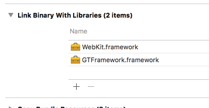
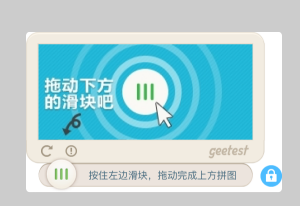
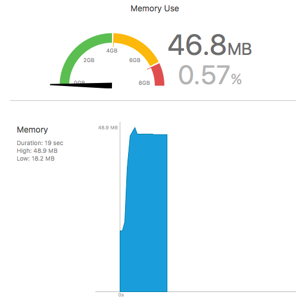
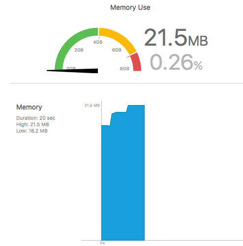
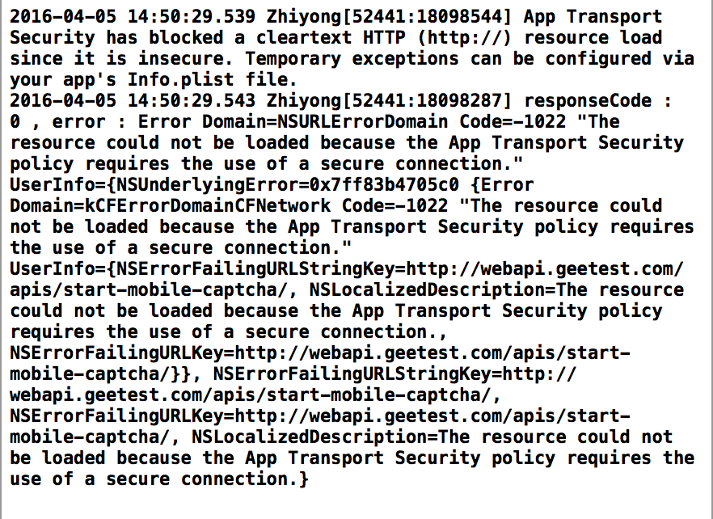

====================================
iOS-常见问题Q&A
====================================

.. contents:: 目录

运行工程报"Undefined symbols for architecture"
================================================

问题截图: 

.. image:: img/question/question01_00.png

解决方案: 

在 -TARGETS->Build Phases->Link Binary With Libraries 添加Webkit.framework

step1: 

.. image:: img/question/solution01_00.png

step2: 

显示的是pc版本的滑动界面
================================================

问题截图: 

解决方案: 

如果已经申请移动版本id，请在你们服务器的配置上替换成移动版id; 
如果你没有申请移动版本的id, 请在极验官网控制台申请，再配置。`极验控制台   <http://account.geetest.com>`__

如图: 

.. image:: img/question/solution02_00.png

验证界面下方出现了大量多余的空白
================================================

问题截图: 

.. image:: img/question/question03_00.png

情形1
-------------------------------------------------------------------

如果你使用的sdk版本是2.15.12.30.1之前的版本

解决: 请更新sdk，能解决一部分情况下的该情况的出现。`极验控制台   <http://account.geetest.com>`__

情形2
-------------------------------------------------------------------

如果你使用的sdk版本是2.15.12.30.1之后版本，该情况只出现在极验控制台使用小图(极验验证的图片分为大小两种尺寸的验证图片)且用户使用的iOS设备的系统是低于iOS 9.0的时候。

解决: 在极验后台上传大尺寸图。我们在移动端推荐使用大尺寸验证图片。`极验控制台   <http://account.geetest.com>`__

验证界面完全空白
================================================

问题截图: 

情形1
-------------------------------------------------------------------

检测传入的challenge是静态的或者因为缓存导致challenge重复使用。

原因: 单个challenge对单次验证是唯一的, 不可以重复使用。

解决: 检测你们传入challenge是不是从服务器动态获取以及服务器获取challenge的方式。如果没有问题，可能是缓存导致，检查缓存机制。如果依旧没有解决，向极验请求技术支持。

情形2
-------------------------------------------------------------------

使用的旧版本id, 但使用了新版本服务端sdk

原因: challenge在服务端sdk被md5加密, 而旧版本id不能与加密的challenge匹配使用

解决: 联系技术支持更新到新版本id或者使用旧版本服务端sdk, 后者不推荐使用

情形3
-------------------------------------------------------------------

使用新版本id, 没有在请求中挂载challenge参数

原因: 新版本id必须与challenge匹配使用

解决: 更新服务端sdk, 并在客户端传入相应参数

情形4
-------------------------------------------------------------------

使用新版本id, 却使用旧版本的服务端sdk

原因: 新版本id必须与加密的challenge使用

解决: 更新服务端sdk即可解决

打开验证时的内存消耗
================================================

事例截图(模拟器iPhone 5s环境下, 同等条件下真机内存消耗数值会较模拟器低很多): 

模拟器下初始加载(未加载验证)
-------------------------------------------------------------------

.. image:: img/question/question05_00.png

模拟器iOS8以下加载验证
-------------------------------------------------------------------

指标: 相较增加38m内存。真机下, 数值会降很多。

原因: UIWebview加载js对资源的消耗很严重。

模拟器iOS8及以上加载验证
-------------------------------------------------------------------

指标: 相较增加3m内存, 真机下, 数值会相应下降一些。

验证请求http 被 block
================================================

原因: iOS9 以上默认禁用http协议, 而验证内部使用了http请求验证数据

解决: `参考README  <https://github.com/GeeTeam/gtapp-ios-oc/blob/master/README.rst>`__

(完)